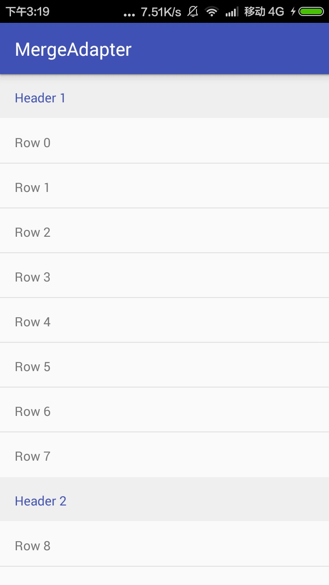
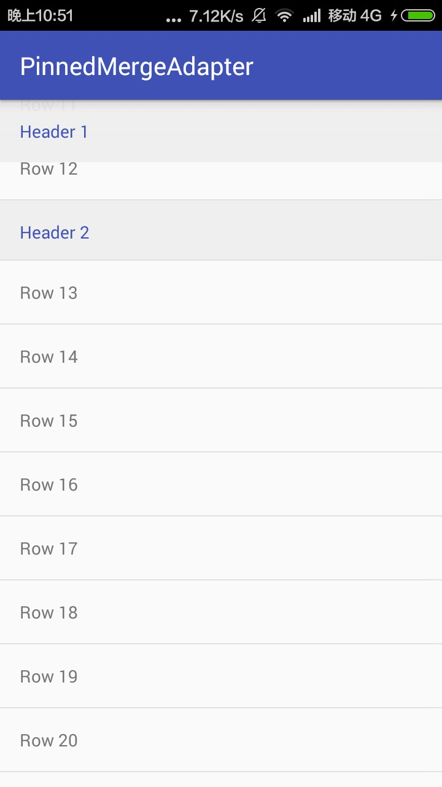
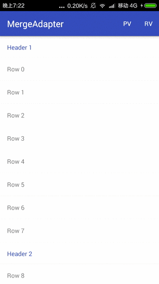
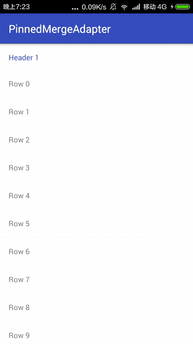
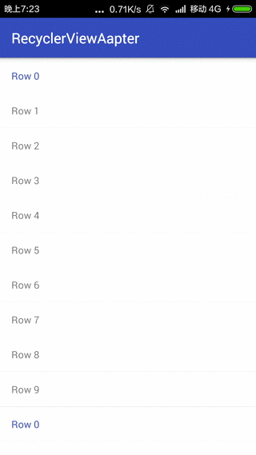

## MergeAdapter

基于 CommonsWare的 [MergeAdapter](https://github.com/commonsguy/cwac-merge) 的扩展
 
### 新增特性
 - 支持HeaderView形式的HeadAdapter
 - 对全局OnItemClick事件的支持
 - 支持PinnedListView的MergeAdapter
 - 支持RecyclerView的MergeRecyclerAdapter
 
 

### 实例代码

支持HeaderView的HeaderAdapter

```java
HeaderAdapter adapter1 = new HeaderAdapter(this, new ArrayList<>(array.subList(0, 8)), R.layout.item_list,R.layout.item_header);
HeaderAdapter adapter2 = new HeaderAdapter(this, new ArrayList<>(array.subList(8, 16)), R.layout.item_list,R.layout.item_header);
HeaderAdapter adapter3 = new HeaderAdapter(this, new ArrayList<>(array.subList(16, 30)), R.layout.item_list,R.layout.item_header);
adapter1.setHeaderType(1);
adapter2.setHeaderType(2);
adapter3.setHeaderType(3);
final MergeAdapter adapter = new MergeAdapter();
adapter.addAdapter(adapter1);
adapter.addAdapter(adapter2);
adapter.addAdapter(adapter3);

listView.setAdapter(adapter);
```


支持OnItemClick事件

```java
listView.setOnItemClickListener(new AdapterView.OnItemClickListener() {
            @Override
            public void onItemClick(AdapterView<?> adapterView, View view, int position, long id) {
                adapter.onItemClick(adapterView, view, position, id);
            }
        });
```


支持PinnedListView

```
final MergeAdapter adapter = new PinnedMergeAdapter();

HeaderAdapter adapter1 = new HeaderAdapter(this, new ArrayList<>(array.subList(0, 13)), R.layout.item_list, R.layout.item_header, 1);
HeaderAdapter adapter2 = new HeaderAdapter(this, new ArrayList<>(array.subList(13, 29)), R.layout.item_list, R.layout.item_header, 2);
HeaderAdapter adapter3 = new HeaderAdapter(this, new ArrayList<>(array.subList(29, 50)), R.layout.item_list, R.layout.item_header, 3);
adapter.addAdapter(adapter1);
adapter.addAdapter(adapter2);
adapter.addAdapter(adapter3);

listView.setAdapter(adapter);
listView.setOnItemClickListener(new AdapterView.OnItemClickListener() {
    @Override
    public void onItemClick(AdapterView<?> adapterView, View view, int position, long id) {
        adapter.onItemClick(adapterView, view, position, id);
    }
});
```


支持RecyclerView

```
final MyAdapter mAdapter = new MyAdapter(array);
        final MyAdapter mAdapter2 = new MyAdapter(new CopyOnWriteArrayList<>(array));


        mRecyclerView.setLayoutManager(new LinearLayoutManager(this));
        mRecyclerView.setItemAnimator(new DefaultItemAnimator());
        mRecyclerView.addItemDecoration(new DividerItemDecoration(this, null));

        final MergeRecyclerAdapter mMergeRecyclerAdapter = new MergeRecyclerAdapter();
        mMergeRecyclerAdapter.addAdapter(mAdapter);
        mMergeRecyclerAdapter.addAdapter(mAdapter2);
        mRecyclerView.setAdapter(mMergeRecyclerAdapter);

```

### 描述

MergeAdapter从[CWAC MergeAdapter](https://github.com/commonsguy/cwac-merge) 复制过来的

HeaderAdapter 需要自己继承ListHeaderBaseAdapter,实现固定的方法，参考MainActivity即可

pinned-section-listview 从[pinned-section-listview](https://github.com/beworker/pinned-section-listview) 复制的listview,修改了部分源代码，主要是修改了PinnedSectionListAdapter的isItemViewTypePinned, 用isItemPinned(position)代替,相关联部分一并改动

MergeRecyclerAdapter 实现了聚合子Adapter的功能,功能类似于MergeAdapter,难点在于onCreateViewHolder(parent,viewType),这一个方法跟listview中的不一样,没有办法根据position确定对应的子Adapter,所以自己定义了一个OnViewTypeCheckListener 辅助实现类似position的功能,具体可以看代码

### Screenshot












### 感谢
[CWAC MergeAdapter](https://github.com/commonsguy/cwac-merge)

[sectionedmergeadapter](https://github.com/abacritt/sectionedmergeadapter)

[pinned-section-listview](https://github.com/beworker/pinned-section-listview)

### Contribution

 请看[CONTRIBUTING.md](/CONTRIBUTING.md)
